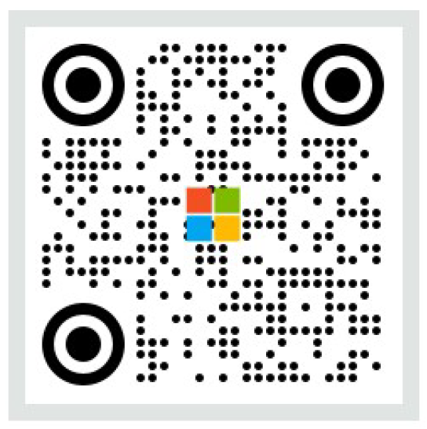

# Monthly Copilot — Snack-size Reads for Work

스낵처럼 가볍게, Copilot 업데이트 한 입에!  
QR 코드를 통해 접속하는 Monthly Copilot 뉴스레터 랜딩 페이지입니다.

## QR Code

아래 QR 코드를 스캔하면 랜딩 페이지로 이동합니다.

<p align="center">
  
</p>

## Architecture

```
┌─────────────────────────────────────────────────────────────────┐
│                         사용자 접근                              │
│                                                                 │
│   📱 QR Code Scan / 🌐 브라우저 직접 접속                        │
│         ↓                                                       │
│   https://ep-aitour-...azurefd.net/r/aitour                     │
└─────────────┬───────────────────────────────────────────────────┘
              ↓
┌─────────────────────────────────────────────────────────────────┐
│               Azure Front Door (Premium)                        │
│  ┌───────────────────┐    ┌──────────────────────────────┐      │
│  │  WAF Policy        │    │  Global Load Balancer &       │     │
│  │  (Prevention Mode) │───→│  SSL/TLS Termination          │     │
│  │  · Rate Limiting   │    │  · Custom Domain Routing      │     │
│  │  · Bot Protection  │    │  · Caching & Compression      │     │
│  └───────────────────┘    └──────────────┬───────────────┘      │
└──────────────────────────────────────────┼──────────────────────┘
                                           ↓
┌─────────────────────────────────────────────────────────────────┐
│            Azure Static Web Apps (Standard)                     │
│                                                                 │
│  ┌─────────────────────────────────────────────────────┐        │
│  │  staticwebapp.config.json                           │        │
│  │  · /r/aitour → 302 → /index.html?utm_source=qr     │        │
│  │  · /r/newsletter → 302 → /index.html                │        │
│  │  · Security Headers (HSTS, CSP, X-Frame-Options)    │        │
│  └─────────────────────────────────────────────────────┘        │
│                                                                 │
│  ┌─────────────────────────────────────────────────────┐        │
│  │  index.html (Monthly Copilot Landing Page)          │        │
│  │  · 6개 콘텐츠 카드 (Editor's Picks + 정기 코너)       │        │
│  │  · 뉴스레터 구독 폼 ──→ POST 요청                    │        │
│  └───────────────────────────┬─────────────────────────┘        │
└──────────────────────────────┼──────────────────────────────────┘
                               ↓
┌─────────────────────────────────────────────────────────────────┐
│               Azure Logic App (Consumption)                     │
│                                                                 │
│  ┌─────────────────────────────────────────────────────┐        │
│  │  HTTP Trigger (POST)                                │        │
│  │       ↓                                             │        │
│  │  이메일 발송 Workflow                                 │        │
│  │  · 구독자 이메일 수신 → 환영 메일 자동 발송             │        │
│  └─────────────────────────────────────────────────────┘        │
└─────────────────────────────────────────────────────────────────┘

CI/CD: GitHub Actions → main 브랜치 push 시 자동 배포
```

## Azure Resources

| Resource | Name | SKU |
|----------|------|-----|
| Resource Group | `rg-aitour-newsletter` | — |
| Static Web App | `swa-copilot-promo` | Standard |
| Front Door | `afd-aitour-global` | Premium |
| WAF Policy | `wafpolicyaitour` | Prevention mode |
| Logic App | newsletter email workflow | Consumption |

## URLs

| Purpose | URL |
|---------|-----|
| SWA Direct | `https://mango-bush-01203ee0f.2.azurestaticapps.net` |
| Front Door | `https://ep-aitour-abf2fubhgfftdufa.b02.azurefd.net` |
| QR Redirect | `/r/newsletter` → 302 → `/index.html` |
| QR Redirect (UTM) | `/r/aitour` → 302 → `/index.html?utm_source=qr&utm_campaign=aitour` |

## 콘텐츠 구성 (Mar. 2026)

### 이번 달 추천 (Editor's Picks)
| # | 제목 | 타입 |
|---|------|------|
| 1 | AI Tour에서 주목할 Copilot 세션 | 스페셜 |
| 2 | 최애의 코파일럿 | 정기 코너 |
| 3 | 에이전톤 2026 우승 사례 | 정기 코너 |

### 정기 코너
| # | 제목 | 타입 |
|---|------|------|
| 4 | Copilot의 실수 모음집 | 정기 코너 |
| 5 | 우리의 Built-in 에이전트 | 정기 코너 |
| 6 | 알립니다 | 정기 코너 |

## Project Structure

```
ai-tour-copilot-landing/
├── index.html                    # 메인 랜딩 페이지 (Monthly Copilot)
├── staticwebapp.config.json      # SWA 라우팅, 리다이렉트, 보안 헤더
├── logic-app-arm-payload.json    # Logic App ARM 배포 페이로드
├── logic-app-definition.json     # Logic App 워크플로우 정의 (뉴스레터 이메일)
├── css/                          # 스타일시트 (예정)
├── images/
│   ├── logo.png                  # Copilot 로고
│   ├── M365_logo.png             # M365 로고
│   ├── Microsoft-logo_rgb_c-wht.png
│   ├── QRcode.png                # QR 코드 이미지
│   └── Microsoft365-*.png        # Hero 이미지 (16x9, 1x1, 9x16)
├── .github/
│   └── workflows/
│       └── azure-swa-deploy.yml  # GitHub Actions CI/CD
├── .gitignore
└── README.md
```

## Local Development

```bash
# SWA CLI로 로컬 실행
npx @azure/static-web-apps-cli start . --port 4280
```

브라우저에서 `http://localhost:4280` 접속

## Deployment

`main` 브랜치에 push하면 GitHub Actions가 자동으로 Azure Static Web Apps에 배포합니다.

### Manual Deploy

```bash
DEPLOY_TOKEN=$(az staticwebapp secrets list --name swa-copilot-promo --resource-group rg-aitour-newsletter --query "properties.apiKey" -o tsv)
swa deploy . --deployment-token $DEPLOY_TOKEN --env production
```

## Security Headers

- **HSTS**: `max-age=31536000; includeSubDomains; preload`
- **CSP**: `default-src 'self'` + Google Fonts + Logic App connect-src
- **X-Content-Type-Options**: `nosniff`
- **X-Frame-Options**: `DENY`
- **Referrer-Policy**: `strict-origin-when-cross-origin`
- **Permissions-Policy**: camera, microphone, geolocation blocked

## License

© 2026 Monthly Copilot · All bytes reserved.
